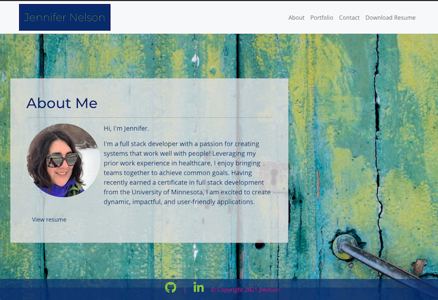
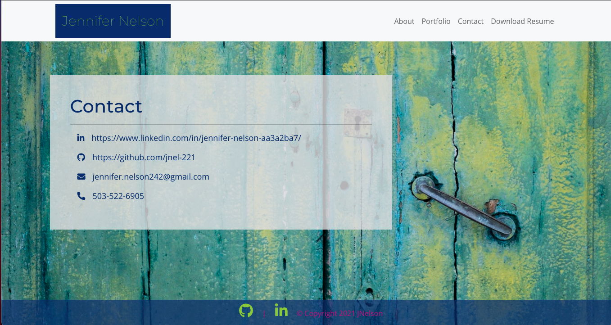

# Jennifer Nelson: React Portfolio

  ## Badge

  

  ## Description

  A dynamic and responsive portfolio created with React, React-Bootstrap, React-PDF, JavaScript, and <3.

  View live portfolio [here](https://jnel-221.github.io/JN_React_Portfolio/#/JN_React_Portfolio/portfolio).


Screenshot of About Me/Landing page.
  

Mobile-responsive view of portfolio page, project modal and navigation.
  

Contact sheet.
  
  
  ## Table of Contents
  
  - [Installation](#Installation)
  - [Usage](#Usage)
  - [Technologies](#Technologies)
  - [Contributing](#Contributing)
  - [Questions](#Questions)
  - [License](#License)
  
  ## Installation

  ```bash
  Clone repo and save in desired location.
  ```

  [Back to Table of Contents](#table-of-contents)
  
  ## Usage

  After cloning and saving the repo, run npm i to install packages locally.

  [Back to Table of Contents](#table-of-contents)
  
  ## Technologies

  This portfolio was created with React.js, React-bootstrap, React-pdf, Node.js, JavaScript, HTML, and CSS.  Design resources include unsplash and Bootstrap.

  
  [Back to Table of Contents](#table-of-contents)
  
  ## Contributing
  
  Design may be adapted to contributers specifications.

  [Back to Table of Contents](#table-of-contents)
  
  
  ## Questions
  
  Questions? You can reach me by email at jennifer.nelson242@gmail.com	. Feel free to check out additional projects at [my GitHub profile](https://github.com/jnel-221).

  [Back to Table of Contents](#table-of-contents)
  
  ## License

  This project is licensed under the terms of the [MIT](LICENSE) license.
  
  [Back to Table of Contents](#table-of-contents)
